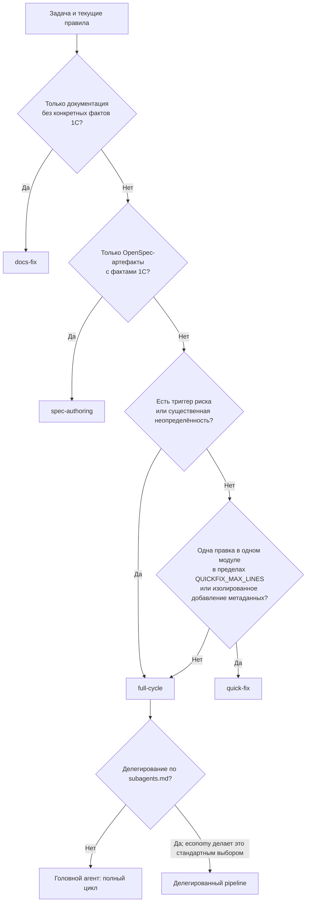
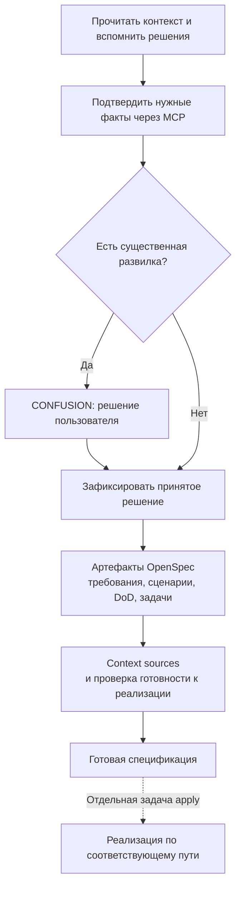
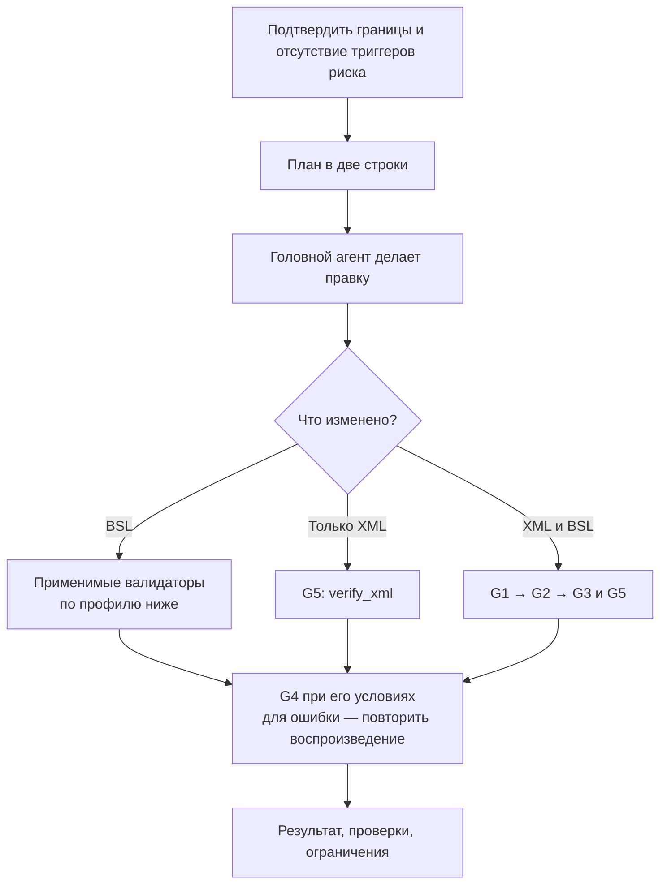
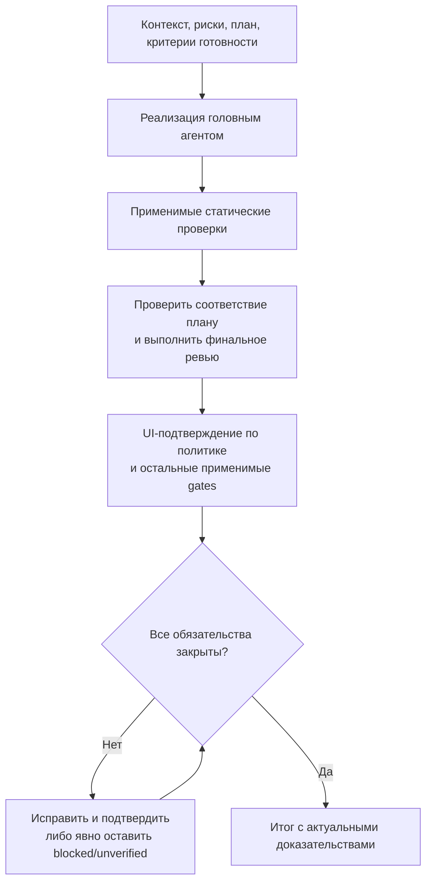
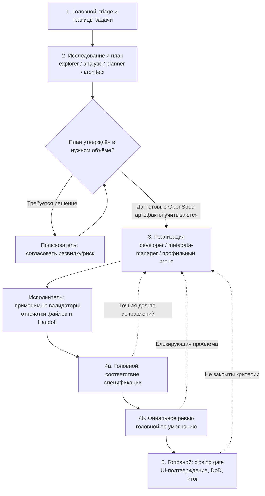
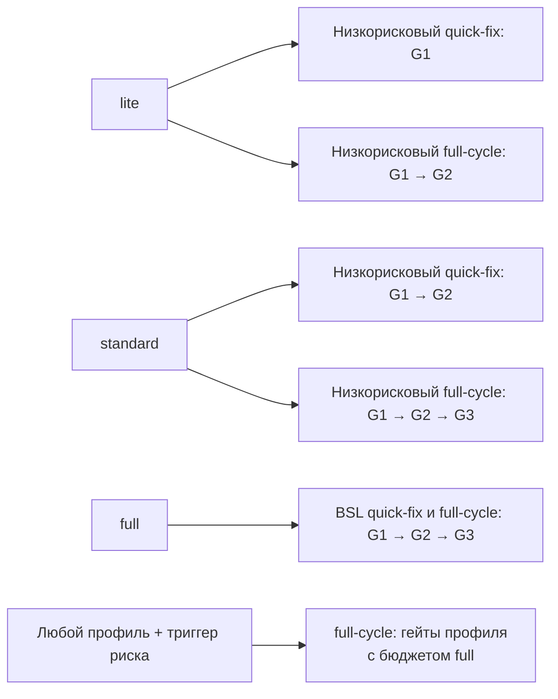
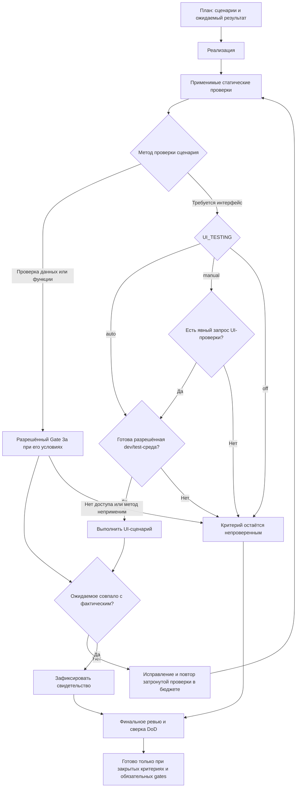

# Workflow текущих rules

Срез правил: 27 сентября 2026. Схемы описывают исходники этого репозитория; установленные копии получают изменения после обновления правил. Краткий обзор всего концепта — в начале [README.md](README.md).

## Что здесь называется режимом

Есть четыре независимые настройки:

- **Режим работы (Mode)** — документация (`docs-fix`), спецификация (`spec-authoring`), аналитика без изменения исходников, быстрый фикс (`quick-fix`), полный цикл (`full-cycle`). Агент следует запросу и риску; отдельной команды `/mode` и значения triage для аналитики пока нет.
- **Уровень качества (Quality)** — `lite`, `standard`, `full`, ключ `VERIFICATION_DEPTH`, команда `/sdlc`. Определяет набор статических валидаторов; это не effort модели.
- **Оркестрация** — `standard` или `economy`, ключ `ORCHESTRATION`, команда `/economymode`. Определяет распределение работы между головным агентом и субагентами.
- **UI-тесты** — `manual` (по умолчанию), `auto`, `off`, ключ `UI_TESTING`, команда `/uitests`. Не управляет обычными проверками через `1c-data-mcp`.

Все шесть сочетаний профиля проверок и оркестрации допустимы. `full` не означает `full-cycle`; `economy` не означает `lite`. Выбор профиля не создаёт OpenSpec change и не разрешает развёртывание.

В этом рабочем каталоге на момент проверки отсутствует `.dev.env`: эффективные значения по умолчанию — `VERIFICATION_DEPTH=standard`, `ORCHESTRATION=standard`, `UI_TESTING=manual`, `QUICKFIX_MAX_LINES=40`. Этот обзор их не переключает.

## 1. Как выбирается режим

Аналитика без правок: вопрос → релевантные источники → проверка гипотез доступными разрешёнными средствами → выводы и ограничения. Такой запрос сам по себе не запускает реализацию или deploy. Диаграмма ниже выбирает режим для задач, предполагающих изменение документации, спецификации или исходников.

Триггеры обязательного повышения до `full-cycle`: транзакционные пути и проведение, изменение публичного контракта `Экспорт`, метаданные, подключённые к поведению, заимствованные объекты расширения, RLS, подписки и регламентные/фоновые задания. Малый размер изменения не отменяет эти условия.

Изолированное добавление метаданных — узкое исключение с полным списком условий в [verification-policy.md](content/rules/verification-policy.md). Если тот же объект сразу подключается к запросу, форме или коду, вся задача становится `full-cycle`.

## 2. Docs-fix — документация и правила

Для самостоятельной задачи `docs-fix` исполнитель — головной агент при обеих оркестрациях. Профиль `/sdlc` не добавляет BSL-валидаторы к текстовым изменениям. Документационный подэтап уже делегированного `full-cycle` может выполняться `1c-doc-writer`.

## 3. Spec-authoring — спецификация с фактами 1С

При `standard` делегирование выбирается по критериям [subagents.md](content/rules/subagents.md). При `economy` объёмное исследование и подготовка артефактов передаются подходящим агентам: `1c-explorer` собирает факты, `1c-analytic` пишет proposal/delta specs, `1c-architect` — design, `1c-planner` — tasks. Головной агент сохраняет ответственность за решения и приёмку спецификации.

Этот путь не входит в implementation pipeline. Ни `lite`, ни `economy` не отменяют подтверждение конкретных фактов 1С. Готовность спецификации не является разрешением на apply. Полный контракт — [sdd-integrations.md](content/rules/sdd-integrations.md).

## 4. Quick-fix — одна локальная правка

Исполнитель остаётся головным агентом, в том числе при `economy`. При обнаружении подключения метаданных, изменения контракта или другого триггера риска задача повышается до `full-cycle`.

Для метаданных, встраивающих или генерирующих BSL, `Quick-fix gate` отдельно требует G1–G3 и G5; это условие не ослабляется профилем.

## 5. Full-cycle — полный цикл разработки

### Прямое выполнение

При `standard` полный цикл может выполняться напрямую. Делегирование выбирается, в частности, при ≥3 модулях, ≥2 объектах метаданных, ≥5 файлах для чтения/механических изменений или независимой полезной ветке исследования. Наличие полного цикла само по себе не требует субагентов.

### Делегированный pipeline, включая economy

При `economy` делегирование исследования, плана и реализации становится выбором по умолчанию в допустимых границах. Решения, постановка задач, выборочная проверка первоисточников, интеграция и закрытие остаются за головным агентом. После двух неудач субагента на ясном задании головной агент выполняет работу сам и отмечает это в отчёте.

Независимые ветки чтения можно выполнять параллельно. Запись последовательна, если не доказано, что области изменений не пересекаются. Следующий исполнитель получает Handoff без пересказа. Головной агент переиспользует свежие результаты валидаторов при совпадении отпечатков файлов и контекста; повторный прогон неизменённого кода запрещён.

Согласование в делегированном pipeline зависит от риска. Для promotion-trigger путей требуется утверждение; готовые утверждённые OpenSpec-артефакты или явное предварительное разрешение уже удовлетворяют этому условию. Для среднего чисто программного изменения без таких рисков агент показывает план и продолжает.

Если OpenSpec выбран для разработки: `propose → apply → archive`. Apply включает реализацию, применимые проверки, подтверждение поведения (UI — для требующих его критериев) и финальное ревью. Чекбоксы и CLI `all_done` не доказывают завершение. При отсутствии обязательного подтверждения критерий остаётся открытым; явная отмена пользователем фиксируется отдельно как `waived by user`.

## 6. Профиль проверок × путь задачи

Обозначения: **G1** — `syntaxcheck_file` для сохранённого BSL; **G2** — `check_1c_code`; **G3** — `review_1c_code`. G3 — MCP-валидатор, а финальное ревью полного цикла — отдельная обязанность.

Эта схема одинакова при `standard` и `economy`. По явному запросу ревью G3 также включается. Для чистого XML BSL-валидаторы не применяются; проверяется G5. При генерации/встраивании BSL проверяются и затронутые модули.

Один успешный проход — обычный случай. После блокирующего исправления: `lite`/`standard` — до двух вызовов выбранного валидатора суммарно, `full` и пути с триггером риска — до трёх. Повторные вызовы без изменения проверяемого состояния запрещены. Исчерпание бюджета без чистого подтверждения означает провал gate.

G4 (влияние), G5 (XML/эквивалент EDT), G3a (проверка на dev/test ИБ) и G6 (применимость на платформе) включаются по собственным условиям. Профиль и оркестрация не отменяют их. Источник — [verification-gates.md](content/rules/verification-gates.md).

## 7. UI, ревью, модели и команды

- **UI:** `/uitests on` (или `auto`) → автоматические применимые проверки; `/uitests manual` → по явному запросу, по умолчанию; `/uitests off` → отключены; `/uitests status` → состояние без изменения. Все профили `/sdlc` и оба режима оркестрации сохраняют это значение. Нужны разрешённая dev/test-среда, URL и инструменты. Если необходимый критерий DoD требует UI-подтверждения, отключение UI оставляет его непроверенным, а не выполненным.
- **Ревью:** полный цикл включает финальное ревью головным агентом, если пользователь явно его не отменил. `1c-code-reviewer` запускается только по явному запросу ревью и с явно выбранной моделью, реально применённой в запуске. Отключение этого субагента не отменяет ревью головным агентом или MCP-валидатор G3.
- **Модели:** `/economymode models` настраивает `SUBAGENT_MODEL_CODING`, `_ANALYSIS`, `_LIGHT`. `coding` пишет код/метаданные и проектирует архитектуру; `analysis` планирует/анализирует/пишет документацию; `light` исследует. `1c-error-fixer` относится к `coding`. Экономия стоимости модели не гарантирована при наследовании модели; остаётся разгрузка контекста головного агента.
- **Применение моделей:** изменение `SUBAGENT_MODEL_*` требует повторного рендера установленных определений; для клиентов, читающих их только при старте, — перезапуска. `ORCHESTRATION` и `VERIFICATION_DEPTH` читаются во время задачи и не требуют рендера.
- **Совместимость:** `/litemode on` → `/sdlc lite`; `/litemode off` → `standard`. Оба сохраняют UI-политику. Если прежний `lite` уже записал `off`, включение UI теперь требует явного `/uitests on` или `/uitests manual`.
- **Другие настройки:** `CAVEMAN` управляет краткостью, `AGENT_MODEL` — поведенческим профилем головного агента, `DEBUG_FAST_PATH` — маршрутом отладки, `METADATA_PREVIEW` — предварительным показом операций метаданных. Они не заменяют путь задачи, QA-профиль или обязательные gates. `rtk` сжимает вывод shell независимо от economy.
- **Доступность инструментов:** `TOOL_*=off` запрещает провайдера; недоступный выбранный `required` блокирует зависимый этап. Деградация в `auto` не превращает непроверенное в проверенное. Economymode не меняет эти условия.

### Где находятся тесты в цикле

Планировать тесты и сценарии разрешено. Правила не предоставляют фреймворки и средства сопровождения unit/regression/acceptance-наборов: агент сам проверяет результат в рамках цикла поддерживаемыми разрешёнными способами. Если `1c-data-mcp` доступен и разрешён, модель выполняет целевые проверки по необходимости — чтобы закрыть конкретный вопрос о корректности результата или граничном случае, в пределах Gate 3a. UI `off`, `lite` и economy их не отключают. Каждый сценарий задаёт действия/входные данные, ожидаемый результат и метод проверки. Статический анализ и ревью выполняют свои задачи, но не подтверждают фактическое поведение.

`/uitests` меняет настройку в существующем `.dev.env`; без файла — только для сессии. Переключение не запускает тесты или deploy. Явное «включи UI и запусти» не требует второго подтверждения переключения; разрешение на конкретную среду и операции по-прежнему учитывается. Сам `/test-fix-loop` остаётся отдельным явным запросом даже при `auto`. Пробел проверки не превращается в успех: отменить конкретный критерий может пользователь, с записью `waived by user`.

## 8. Что согласовано при этой проверке

Устранены безусловные требования всей цепочки валидаторов в делегированном pipeline, brief-шаблоне и пяти исполняющих ролях: выбор gates теперь явно ведёт к единому `verification-policy.md`. В общей инструкции субагентов закреплено, что экономия и делегирование не меняют этот выбор. Уточнён бюджет подтверждения блокирующего исправления при `lite`.

Убрана неоднозначность вокруг `docs-fix`: самостоятельная задача выполняется головным агентом; документирование внутри делегированного полного цикла может быть подзадачей. Для `spec-authoring` разделены ответственность головного агента и подготовка артефактов субагентами. Обсуждение economymode больше не может трактоваться как его включение. Описание `light` в команде согласовано с `coding`-ролью исправления ошибок.

Источники: [AGENTS.md](AGENTS.md), [verification-policy.md](content/rules/verification-policy.md), [subagents.md](content/rules/subagents.md), [subagent-core.md](content/rules/subagent-core.md), [subagent-pipeline.md](content/rules/subagent-pipeline.md), [orchestrator-economy.md](content/rules/orchestrator-economy.md), [sdd-integrations.md](content/rules/sdd-integrations.md), [verification-delivery.md](content/rules/verification-delivery.md), [/sdlc](content/commands/sdlc.md), [/economymode](content/commands/economymode.md), [/litemode](content/commands/litemode.md), [dev-standards-env.md](content/rules/dev-standards-env.md).

Дополнительно введён `/uitests`, устранено неявное изменение UI-политики командами `/sdlc` и `/litemode`. Условия запуска `1c-tester` согласованы с `auto`; отсутствие URL при явном запросе требует уточнить его, при автоматической проверке оставляет критерий непроверенным. Запрет планировать тесты заменён границей поддержки: сценарии планируются, результат проверяется внутри цикла, встроенных unit/regression/acceptance-наборов нет.

## 9. Изменённые файлы и проверка

- [WORKFLOWS.md](WORKFLOWS.md) — восемь диаграмм, сочетания режимов и место проверок в цикле.
- [AGENTS.md](AGENTS.md) — подтверждение поведения в полном цикле и отдельная UI-политика.
- [README.md](README.md) — ссылка на схемы и управление UI-проверками.
- [.dev.env.example](.dev.env.example) — независимая настройка UI-проверок.
- [uitests.md](content/commands/uitests.md) — явное управление UI-политикой.
- [sdlc.md](content/commands/sdlc.md), [litemode.md](content/commands/litemode.md) — смена глубины сохраняет UI-политику.
- [dev-standards-env.md](content/rules/dev-standards-env.md) — переключение UI и условия запуска.
- [deploy-and-test.md](content/commands/deploy-and-test.md), [test-fix-loop.md](content/commands/test-fix-loop.md), [tester.md](content/agents/tester.md) — согласование с явной UI-политикой.
- [sdd-integrations.md](content/rules/sdd-integrations.md), [verification-delivery.md](content/rules/verification-delivery.md) — планирование сценариев и фактическая проверка результата.
- [1c-change-package/SKILL.md](content/skills/1c-change-package/SKILL.md) — план проверок и границы свидетельств поведения.
- [openspec/README.md](openspec/README.md), [openspec/changes/README.md](openspec/changes/README.md) — сценарии внутри apply и границы поддержки тестовых наборов.
- [orchestrator-economy.md](content/rules/orchestrator-economy.md) — независимость QA, ответственность за спецификации, явное намерение переключения.
- [subagents.md](content/rules/subagents.md) — приоритет triage и применимые gates в brief-шаблоне.
- [subagent-core.md](content/rules/subagent-core.md) — единая точка выбора gates для субагентов.
- [subagent-pipeline.md](content/rules/subagent-pipeline.md) — проверки по глубине и согласованное исключение для документации.
- [verification-policy.md](content/rules/verification-policy.md) — бюджет подтверждения при `lite`.
- [economymode.md](content/commands/economymode.md) — исправление описания `light` и `coding`.
- [developer.md](content/agents/developer.md) — применимость валидаторов в процессе и чеклисте.
- [error-fixer.md](content/agents/error-fixer.md) — применимость валидаторов в процессе и чеклисте.
- [metadata-manager.md](content/agents/metadata-manager.md) — выбор BSL gates в чеклисте.
- [refactoring.md](content/agents/refactoring.md) — выбор gates в обоих чеклистах.
- [performance-optimizer.md](content/agents/performance-optimizer.md) — выбор gates при проверке оптимизации.

Проверка исходных семи схем: рендер Mermaid и TypeScript-проверка отдельной интерактивной схемы. После добавления `/uitests` и восьмой схемы выполнены `tools/validate-rules.ps1 -Strict` и `git diff --check`; лимиты контекста сохранены. Повторный рендер диаграмм заблокирован сетевыми ограничениями при загрузке Mermaid; новая диаграмма визуально не проверена. Отдельная интерактивная схема отражает первоначальную версию; актуальная UI-политика описана здесь. Тела внешнего корпуса стандартов недоступны: их содержимое и заголовки валидатор не проверял. Реальные исполнения сценариев агентами, BSL/ИБ и UI-тесты 1С не запускались — изменения относятся к документации правил. Установленные копии не обновлялись.

Ежемесячная проверка обновлений выполнена без установки: у пяти запущенных образов с именем `comol/*:tag` digest совпал с публикацией своего тега. Образы, запущенные по локальному ID, и отсутствие `.ai-rules.json` не позволяют подтвердить полную актуальность MCP и установленной версии rules; новый manifest не создавался.
